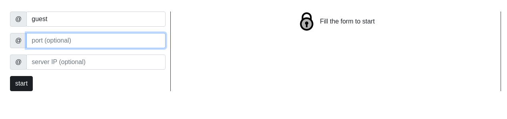
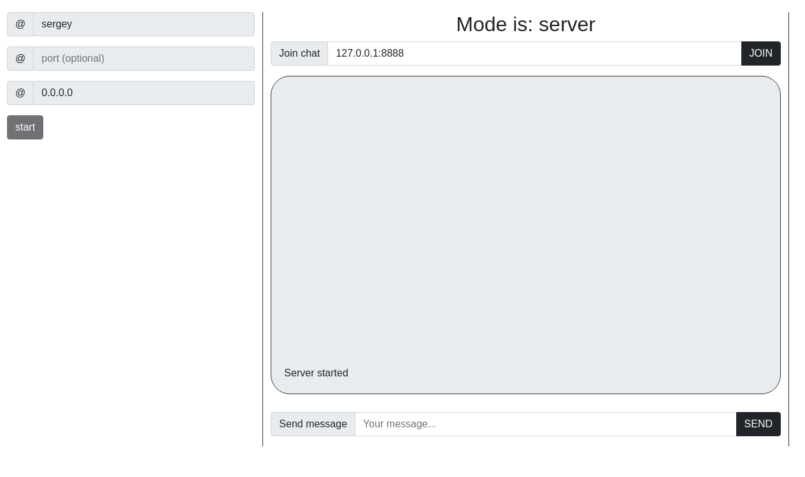
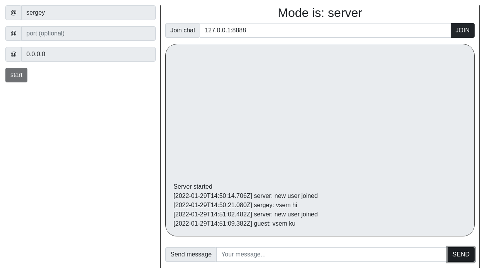

# gRPC-chat

Приложение для p2p взаимодействия через gRPC, написанное на node.js + electron.
## Для проверки работоспособности можно ввести следующие команды:
````  
  yarn install
  yarn start
````

## Демонстрация



